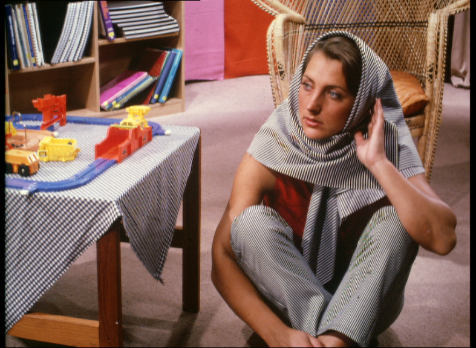
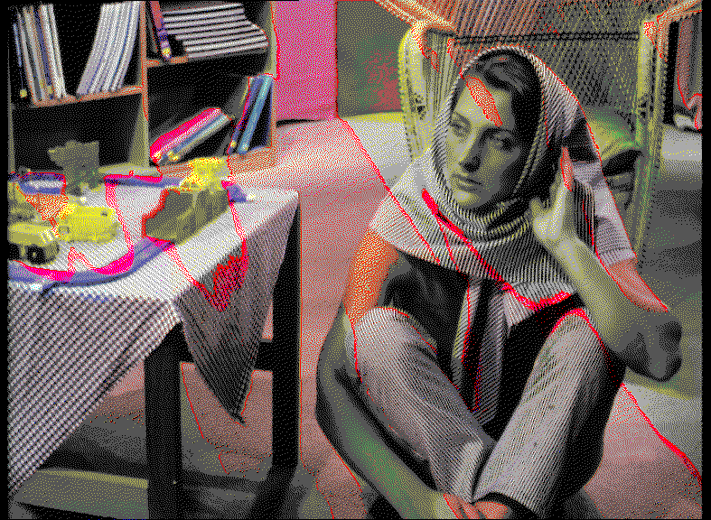
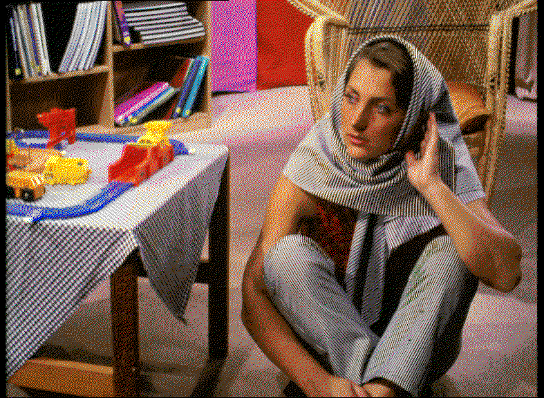

Source: The standard Barbara test image, downloaded from <http://demo.ipol.im/demo/103/input/barbara.jpg>, which seemed to have a larger and more complete image than most. The image was then (losslessly) converted into PNG format.

This test is useful for seeing behavior on textures that are already high-frequency. Remarkably, these textures seem to be well preserved.

Additionally, when run on the RGBI palette, this image demonstrates a particularly dramatic example of a failure mode for Floyd-Steinberg on small palettes. Clamping intermediate colors to fall within a sensible range fixes the worst of these issues, but throws away error, leading the image to look overall different. Note that this failure is highly palette- and image-dependent, as the result on the Macintosh 16-color palette is completely reasonable. The simplex dither avoids these problems but gives a slightly more grainy result.

