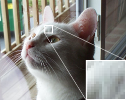

Source: <https://commons.wikimedia.org/wiki/File:Dithering_example_undithered.png>

Dithering using the RGBI palette demonstrates how error-diffusion dithering (and in particlar Floyd-Steinberg) can be vulnerable to "worms" where noticeable pixels align. Additionally, it shows how large sections can change color, with the error pushed elsewhere. The simplex dither solves this at the cost of a more noisy and grainy image.

