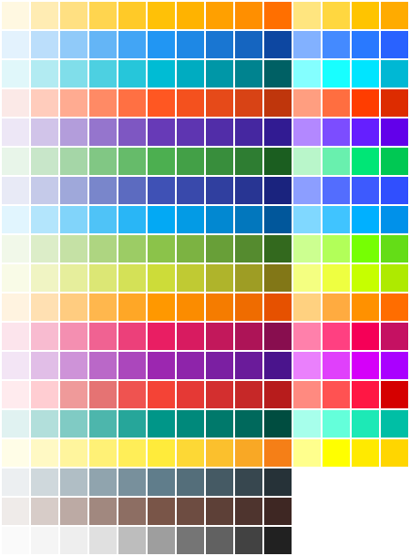

A simple collection of solid color squares. Specifically, the Material Design colors are used, since they cover a fairly wide range and don't fall on nice even RGB values.

This is a useful test of correctness and debugging tool, particularly for gamma issues.

