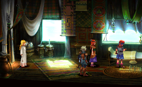

A scene from a PSX game, Chrono Cross, that was used to demonstrate [Yliluoma's arbitrary-palette dithering algorithms](https://bisqwit.iki.fi/story/howto/dither/jy/). The simplex algorithm follows a related methodology to Yliluoma's algorithms.

The handpicked palette for this task does not enclose all the colors in the image, so this stresses the edge cases of the simplex algorithm and demonstrates the less quantifiable choices that the algorithms make. For Floyd-Steinberg, it makes clamping of intermediate values almost essential. Additionally, due to the small image size, many of the details are only a few pixels in size.
